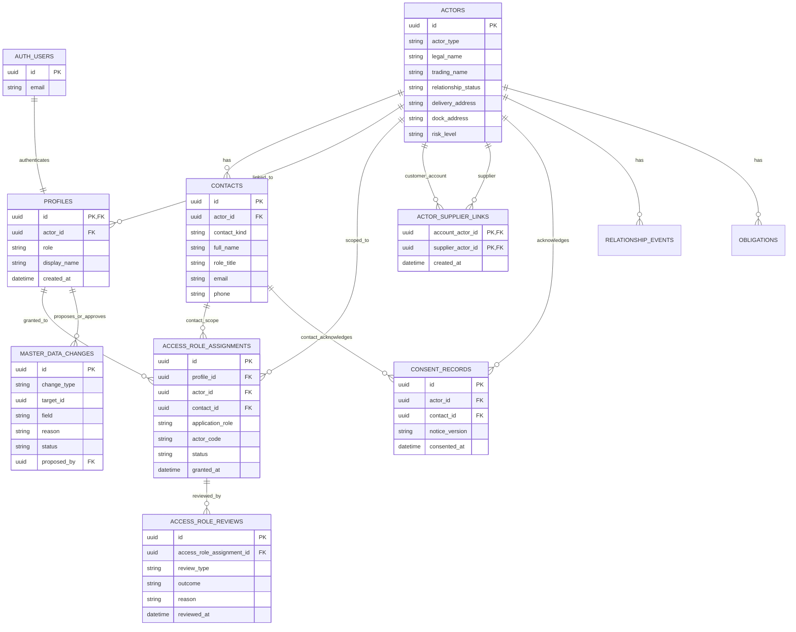
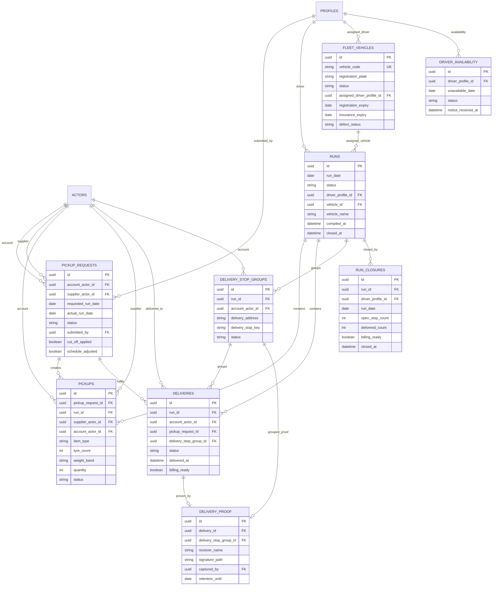
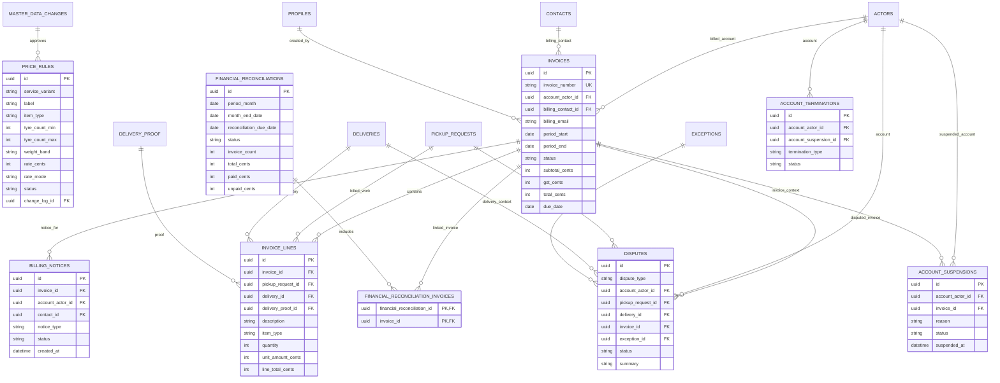
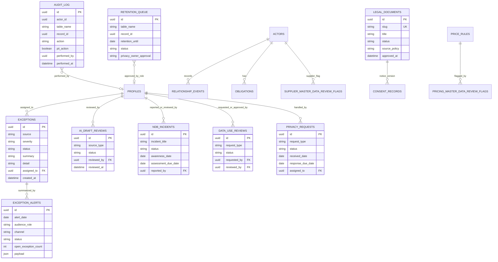

# Moto & Co Couriers Entity Relationship Diagram v2.0

Status: draft for approval.

Last updated: 2026-07-02.

Build/service: Moto & Co Couriers V1 portal and website.

Owner: Moto & Co Logistics.

Database engine: Supabase PostgreSQL.

Source basis: visible local migrations in `supabase/migrations/`, `supabase/seed/release_one_seed.sql`, BOAS v2.0, SOP/policy baseline v2.0, and `docs/software-scope-v2.0.md`.

## ERD Control Note

This ERD documents the visible local schema plus approved v2.0 logical data requirements. It does not claim the local migration folder is a complete copy of the production database.

Known mismatch: `docs/platform-env-contract.md` references production migration `202606190034_super_admin_provisioning.sql`, but that migration file is not present in the visible local `supabase/migrations/` folder. Reconcile that before any further schema or role/access change.

## Notation Key

| Symbol | Meaning |
| --- | --- |
| `||--o{` | One required parent to zero or many children |
| `||--|{` | One required parent to one or many children |
| `}o--||` | Many optional children to one required parent |
| `||--o|` | One required parent to zero or one child |
| `PK` | Primary key |
| `FK` | Foreign key |
| `UK` | Unique key |
| `LOGICAL` | Approved/logical requirement not confirmed as a visible Supabase table |

## 1. Access, CRM, And Master Data



### Access Notes

- `actors` stores both customers/workshops and suppliers.
- `actor_supplier_links` stores approved customer-to-supplier access.
- `profiles.role` in the visible first migration is coarse: `client`, `driver`, `admin`.
- BOAS v2.0 requires `super_admin`, `admin`, `client_ops`, `client_billing`, `driver`, and `no_login`.
- Visible local migrations include `access_role_assignments.application_role` values for `client_operational`, `client_billing`, `driver`, and `admin`.
- The visible local migration folder does not include the later referenced `super_admin` provisioning migration. Treat role/access ERD as requiring migration reconciliation before changes.
- Receiver is not modeled as a login profile. Receiver name/signature are captured in `delivery_proof`.

## 2. Operations, Runs, Pickup, Delivery, And POD



### Operations Notes

- Delivered status is proof-driven. `delivery_proof` creates completion evidence and can complete a grouped stop.
- POD signature objects live in the private `delivery-proof` Supabase Storage bucket; `delivery_proof.signature_path` stores the private object path.
- `delivery_stop_groups` allow one receiver name/signature to cover multiple deliveries for the same account/address.
- Current V1 decision rejects a hard previous evening-before/day-before run lock.
- Driver-created daily run and depot collection choices are approved as requirements but need explicit persistence design before build. See section 5.

## 3. Pricing, Billing, Invoices, Disputes, And Financial Controls



### Billing Notes

- V1 runtime ends at invoice PDF generation/download. Admin emails PDFs manually outside the portal.
- Payment follow-up, bank reconciliation, BAS/accountant handoff, and accounting API integration are out of runtime.
- `price_rules` is the pricing source of truth. Drivers must not enter or override prices.
- Approved seed pricing uses: 1 tyre $18.50, 2 tyres $24.00, 3 tyres $33.00, 4+ tyres $12.30 each, parts up to 5kg $17.20, parts 5-10kg $21.00, parts 10kg+ from $25.00, return $6.00, out-of-zone $10.00.
- The visible earliest migration has older `price_rules` and `pickups` check constraints for item types/weight bands. Verify live schema and add a corrective migration if the live constraints do not match the approved seed.
- A distinct invoice PDF download/evidence table is approved as a logical baseline object but is not visible as a current local migration table. See section 5.

## 4. Exceptions, Audit, Privacy, Retention, And Governance



### Governance Notes

- `audit_log` and `retention_queue` are generic cross-table controls; they store `table_name` and `record_id`, so the database does not express every relationship as a hard foreign key.
- `delivery_proof` and `audit_log` are protected as immutable/append-only in local migrations.
- Privacy Owner is role-based GM Moto & Co Logistics.
- Legal pages are draft until owner/legal approval is recorded.

## 5. Approved Logical Objects Not Yet Confirmed As Visible Base Tables

The following objects are part of the v2.0 baseline or field-tested requirement, but they are not confirmed as distinct Supabase base tables in the visible local migration folder.

```mermaid
erDiagram
    DRIVER_DEVICE ||--o{ LOCAL_DEVICE_OUTBOX : stores_pending
    LOCAL_DEVICE_OUTBOX ||--o{ OFFLINE_SYNC_ATTEMPT : retries
    LOCAL_DEVICE_OUTBOX }o--o| PICKUP_REQUESTS : may_update
    LOCAL_DEVICE_OUTBOX }o--o| PICKUPS : may_update
    LOCAL_DEVICE_OUTBOX }o--o| DELIVERIES : may_update
    LOCAL_DEVICE_OUTBOX }o--o| DELIVERY_PROOF : may_create
    DRIVER_DAILY_RUN ||--|| RUNS : materializes_as
    DRIVER_DAILY_RUN ||--o{ DEPOT_COLLECTION_EVENT : includes
    DEPOT_COLLECTION_EVENT }o--o| PICKUP_REQUESTS : optional_con_note
    DEPOT_COLLECTION_EVENT }o--|| ACTORS : supplier
    INVOICE_PDF_DOWNLOAD_RECORD }o--|| INVOICES : evidence_for
    PROFILES ||--o{ INVOICE_PDF_DOWNLOAD_RECORD : downloaded_by

    DRIVER_DEVICE {
        string device_id LOGICAL
        string browser
        string user_agent
    }

    LOCAL_DEVICE_OUTBOX {
        uuid id LOGICAL
        uuid profile_id
        string target_table
        uuid target_record_id
        string action_type
        json payload
        string sync_status
        datetime created_at
    }

    OFFLINE_SYNC_ATTEMPT {
        uuid id LOGICAL
        uuid local_outbox_id
        string result
        string error_message
        datetime attempted_at
    }

    DRIVER_DAILY_RUN {
        uuid id LOGICAL
        uuid run_id
        uuid driver_profile_id
        date run_date
        datetime created_at
        string status
    }

    DEPOT_COLLECTION_EVENT {
        uuid id LOGICAL
        uuid driver_daily_run_id
        uuid supplier_actor_id
        uuid pickup_request_id
        string collection_type
        string evidence_note
        datetime captured_at
    }

    INVOICE_PDF_DOWNLOAD_RECORD {
        uuid id LOGICAL
        uuid invoice_id
        uuid downloaded_by
        datetime downloaded_at
        string pdf_path_or_hash
    }
```

### Required Decisions Before Building These Objects

| Logical object | Decision needed |
| --- | --- |
| `LOCAL_DEVICE_OUTBOX` | Keep purely same-device/browser local, or also persist sync attempts server-side for Admin audit? |
| `OFFLINE_SYNC_ATTEMPT` | If server-side, define what error detail is safe to store and retention period. |
| `DRIVER_DAILY_RUN` | Decide whether this is a distinct table or a `runs` status/source extension. |
| `DEPOT_COLLECTION_EVENT` | Approve exact collection types: planned milk-run, brought-forward complete next-day package, no-con-note/customer missed portal entry. |
| `INVOICE_PDF_DOWNLOAD_RECORD` | Decide whether invoice fields/audit are enough, or whether a separate PDF download evidence table is required. |

## 6. Current Visible Table Inventory

| Area | Tables visible in local migrations |
| --- | --- |
| CRM/access | `actors`, `contacts`, `profiles`, `actor_supplier_links`, `consent_records`, `access_role_assignments`, `access_role_reviews` |
| Operations | `pickup_requests`, `runs`, `pickups`, `deliveries`, `delivery_stop_groups`, `delivery_proof`, `run_closures`, `driver_availability`, `fleet_vehicles` |
| Billing | `price_rules`, `invoices`, `invoice_lines`, `billing_notices`, `financial_reconciliations`, `financial_reconciliation_invoices` |
| Disputes/exceptions | `exceptions`, `exception_alerts`, `disputes`, `account_suspensions`, `account_terminations` |
| Governance/privacy | `master_data_changes`, `relationship_events`, `obligations`, `audit_log`, `retention_queue`, `legal_documents`, `ai_draft_reviews`, `ndb_incidents`, `data_use_reviews`, `privacy_requests` |
| Review flags/notices | `supplier_master_data_review_flags`, `pricing_master_data_review_flags`, `operational_notices` |

## 7. ERD Reconciliation Gaps

| Gap | Evidence | Required action |
| --- | --- | --- |
| Production migration referenced but not present locally | `docs/platform-env-contract.md` references `202606190034_super_admin_provisioning.sql`; visible local folder does not contain it. | Pull, export, or reconstruct production migration state before schema changes. |
| Super Admin role not visible in local SQL role assignment check | BOAS v2.0 requires `super_admin`; visible access-role SQL lists `client_operational`, `client_billing`, `driver`, `admin`. | Reconcile live role schema and local migrations. |
| Coarse `profiles.role` conflicts with richer role model | First visible migration has `profiles.role` check for `client`, `driver`, `admin`. | Decide whether `profiles.role` remains coarse and `access_role_assignments` is authoritative, or migrate profile roles. |
| Driver daily-run workflow needs persistence model | Approved in baseline, not fully expressed by visible tables. | Approve `runs` extension or new `driver_daily_run`/`depot_collection_event` tables. |
| Offline outbox is local only | Runtime behavior uses device/browser local state. | Decide whether Admin-auditable sync attempts need server persistence. |
| Invoice PDF evidence is logical but not table-confirmed | V2 data object says invoice PDF/download evidence; local migrations use `invoices`/`invoice_lines`. | Decide if a separate table is required. |
| Price rule constraint alignment requires verification | Seed has approved bands/types; earliest migration has older check values. | Verify live constraints and add corrective migration if needed. |

## 8. Build Rule

Any change to one of these entities must update this ERD in the same change set:

- new table
- removed table
- new foreign key
- changed role/access model
- changed status lifecycle
- changed billing/POD/offline evidence model
- changed retention/audit/privacy model

No further runtime build should proceed until section 7 is reviewed and either approved, rejected, or converted into explicit backlog work.

## Change Log

| Date | Change | Author |
| --- | --- | --- |
| 2026-07-02 | Initial ERD v2.0 created from templates, baseline v2.0, visible migrations, seed data, and runtime docs. | Codex |
